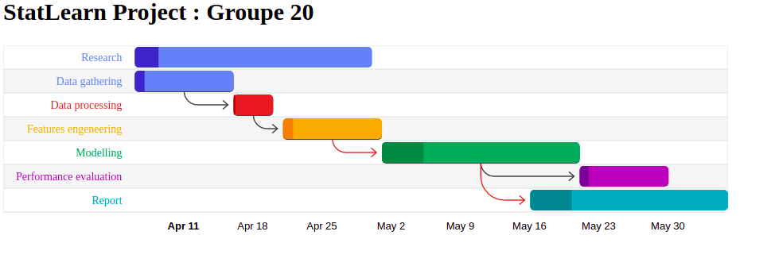

Research Title
----------
 Language detection by audio analysis 

----------

Abstract
----------

This project intends to evaluate differences between languages by analyzing various samples of human speech in different languages. We will try to extract from each audio sample 
relevant features that will help understand differences between those languages which a view to detecting the language spoken from an audio sample.

----------

Main research aim \& framework
----------
  The main goal is to perform a language detection from an audio sample and also to characterize each language by trying to explain its underlying structure. 
At first we thought about  doing a project as close as possible from features offered by Arduino software such as audio analysis, and then to simply to understand more the structure of each language and try to see if there were a substantial difference between them.

### Papers and articles 
  - Article on web[https://medium.com/language-insights/sound-frequencies-of-language-714b97811408]
  
  - Factor analyses of critical-band-filtered speech[ https://www.nature.com/articles/srep42468]

----------

IML paper(s) you like (at this point!)
----------

- Work in progress

-------

Data source(s) 
----------
We will be using the Voxlingua107 dataset essentialy, which is a dataset of audio speech samples in various languages .

### Datasets 
 - VoxLingua107[http://bark.phon.ioc.ee/voxlingua107] 

----------

Data collection
----------

We actually are not planning to collect data but for testing purpose, since it would be difficult to gather a sample for all languages to work on. But we could ask friends to provide some samples with a view to testing our models built on the data source specified above.

----------

Model \& Methods
----------
For now we are planning to use simple methods like 

 - Multiclass Classification
 - Clustering 
 - SVM
 - Tree based methods
   
Eventually an neural network based model could be implemented to assess the performance of our IML based method and evaluate how they compare .

Currently we are still searching for a suitable IML analysis technique to use for our project .

----------

Software/Hardware Toolkit
----------

Our main software will be R with dedicated libraries like:

  - TuneR
  - Seewave
  - wraasp
  - phonTools
  - audio 
  - signal
  - audiolyzR

And others software like MATLAB and associated toolboxes, and scripts in Python and others.

----------

Project Timeline
----------

----------

References
----------

-Ueda, K. and Nakajima, Y. An acoustic key to eight languages/dialects: Factor analyses of critical-band-filtered speech. Sci. Rep. 7, 42468; doi: 10.1038/srep42468 (2017).

(To be completed later )
----------
